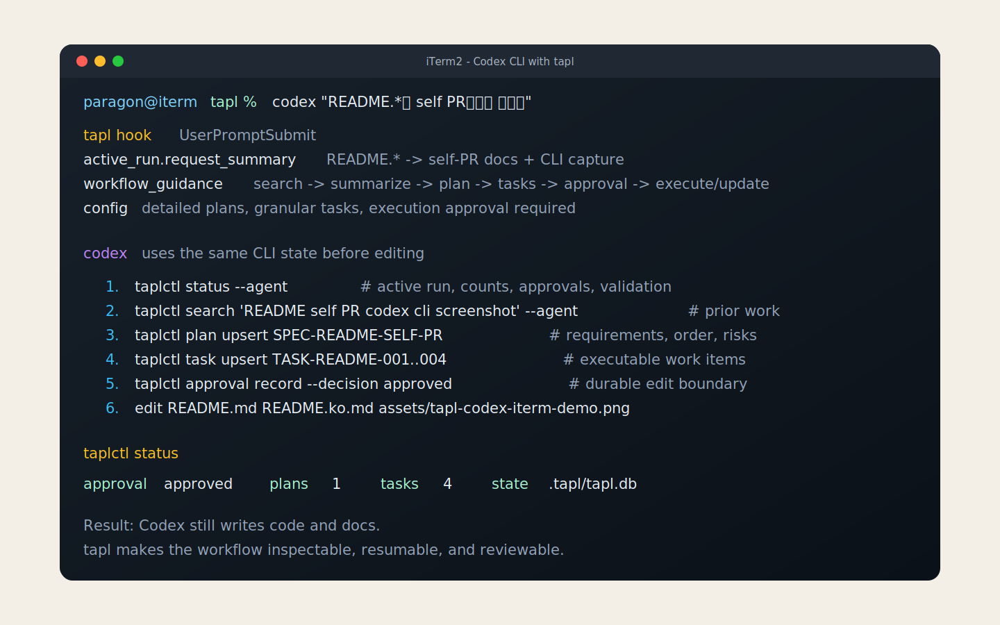
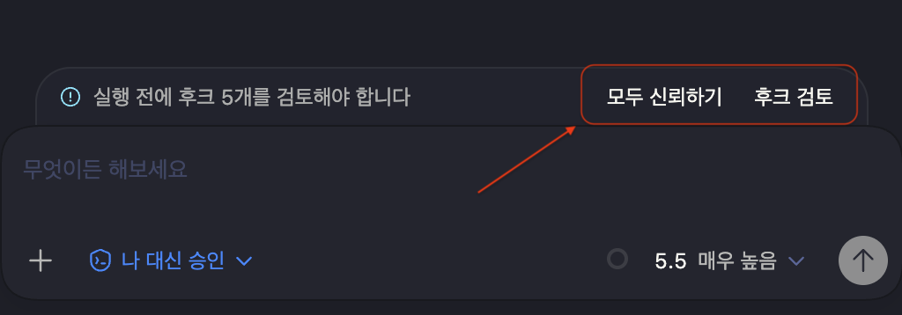

<p align="center">
  
</p>

# tapl

[English](README.md)

`tapl`은 Codex CLI가 저장소 안에서 진행하는 개발 작업을 놓치지 않도록
기록합니다. 요청마다 사용자의 지시, Codex의 plan, task, finding, approval,
lifecycle event, archive, 검색 가능한 history를 repo-local SQLite DB에
저장합니다. 코드는 여전히 Codex가 쓰고, `tapl`은 작업 중 상태 확인과
context가 사라진 뒤의 재개를 가능하게 합니다.

## 빠른 시작

[설치 상세](#설치-상세)를 한 번 따라 한 뒤, repository 안에서 Codex를 평소처럼
사용하면 됩니다.

## 어떻게 동작하나요?

핵심은 또 하나의 prompt template이 아닙니다. 평범한 Codex CLI 요청 주변에
상태가 생기는 것입니다. 아래 capture-style 이미지는 이번 README 재작성 중
`tapl`이 기록한 명령 흐름을 반영합니다.

<p align="center">
  
</p>

설치 후에는 Codex를 평소처럼 사용하면 됩니다. `tapl`은 tool call
전에 repo-local workflow state를 Codex에게 전달하고, 작업 중 plan/task를
기록하며, Codex가 멈추기 전에 run 상태를 검증합니다. 보통은 workflow record를
직접 쓰는 명령을 사람이 실행할 필요가 없습니다.

상태는 `.tapl/tapl.db`에 저장됩니다. 그래서 다음 Codex session, hook, 사용자,
VS Code viewer가 같은 run을 확인할 수 있습니다.

## 왜 필요한지

Codex session은 일을 잘합니다. 하지만 긴 개발 작업에는 마지막 prompt 이상의
정보가 필요합니다.

- 사용자가 무엇을 요청했나?
- agent가 어떤 plan을 골랐나?
- 아직 남은 task는 무엇인가?
- durable file edit가 승인됐나?
- 구현 중 무엇을 배웠나?
- 다음 session이 그 history를 검색할 수 있나?

`tapl`은 하나의 전역 CLI와 repo-local SQLite DB로 이 질문에 답합니다.

## 기능

설치 후에는 이 workflow가 Codex 사용 중 자동으로 실행됩니다. Hook이
`taplctl`을 호출하고, lifecycle context가 Codex에게 어떤 state를 기록해야
하는지 알려줍니다. 사용자는 Codex가 무엇을 기록했는지 확인하거나 검증하고
싶을 때만 CLI를 보면 됩니다.

### 1. 현재 Codex run 확인

현재 repository에서 Codex가 기록한 내용을 보고 싶을 때는 다음 명령을 사용합니다.

```sh
taplctl status
taplctl validate
```

`status`는 active request, plan, task, finding, approval state, recent
activity를 보여줍니다. `validate`는 긴 Codex session을 나중에 이어가기 어렵게
만드는 plan/task/approval 누락을 알려줍니다.

통합 도구에는 `--json` 출력이 그대로 제공됩니다. Codex hook은 내부적으로
Codex가 효율적으로 읽을 수 있는 간결한 출력을 위해 `--agent`를 사용하지만,
일반 사용자가 따라 실행하는 모드는 아닙니다.

### 2. Plan과 task는 Codex가 기록하게 두기

Plan과 task는 흩어진 Markdown 메모가 아니라 first-class record입니다.
Codex는 `tapl` lifecycle guidance를 받고, structured CLI field로 plan/task
내용을 기록합니다. `tapl`은 저장된 record의 Markdown body를 안정적인 템플릿으로
렌더링합니다.

일반적인 사용에서는 Codex에게 작업을 요청하고, 설치된 hook이 record를 최신
상태로 유지하게 두면 됩니다. Workflow state를 디버깅하거나 수동으로 보정해야
할 때는 command help에서 필드 규칙을 확인할 수 있습니다.

```sh
taplctl plan set --help
taplctl task set --help
taplctl approval set --help
```

### 3. 검색 가능한 완료 작업 history

지난 작업은 archive로 남기고 검색할 수 있습니다.

```sh
taplctl search "workflow dashboard"
taplctl search "workflow dashboard" --limit 5
taplctl item show --id 1
```

Search는 SQLite FTS를 사용하고, semantic dependency를 설치하면 semantic/vector
search도 사용할 수 있습니다. 완료된 run은 `taplctl archive list`와
`taplctl archive show --id <id>`로 확인합니다.

### 4. Codex lifecycle 주변의 hook

`tapl`은 다음 Codex hook wiring을 설치합니다.

- `UserPromptSubmit`
- `PreToolUse`
- `PermissionRequest`
- `PostToolUse`
- `Stop`

Hook은 `taplctl hook-event`를 호출하고 현재 workflow state를 읽은 뒤, 짧은
lifecycle context를 반환합니다. Agent는 의도를 해석하고, hook은 경계를 지킵니다.

### 5. 하나의 CLI, repo-local state

`taplctl`은 한 번 설치합니다. 각 repository는 자기 `.tapl/tapl.db`를 가집니다.

이 분리는 설치를 단순하게 유지하면서도 한 workspace의 workflow state가 다른
workspace로 새지 않게 합니다.

### 6. 선택 가능한 VS Code viewer

`vscode-extension/`의 VS Code extension은 같은 state를 다음 명령으로 읽습니다.

```sh
taplctl status --json
taplctl archive list --json
taplctl search --json
taplctl item show --id <id> --json
```

Activity bar에서 active run, plan, task, finding, archive, search result를 볼
수 있습니다.

## 설치 상세

### 필요 환경

- Python 3.11 이상. 함께 제공하는 Homebrew formula는 `python@3.12`를 사용합니다.
- FTS5와 extension loading을 지원하는 SQLite.
- 함께 제공하는 formula로 설치할 경우 Homebrew.
- Source 개발 또는 build를 할 경우 `uv`.
- Workflow viewer를 사용할 경우에만 VS Code.

### Homebrew

```sh
brew tap qkdxorjs1002/tap
brew trust --formula qkdxorjs1002/tap/taplctl
```

그 다음 두 formula 중 하나만 설치합니다.

```sh
# 기본 workflow tracking
brew install taplctl
```

```sh
# Semantic search 지원 포함
brew install taplctl-semantic
```

`taplctl-semantic`을 선택했다면 semantic search 모델을 미리 로딩해둘 수 있습니다.

```sh
brew services start taplctl-semantic
```

그 다음 Codex에 연결할 범위를 선택합니다.

```sh
# 대부분의 사용자: 내 Codex 계정에 한 번 설치
taplctl install user

# 또는 현재 repository에만 설치
taplctl install repo

taplctl validate
```

설치 후 Codex가 처음 확인을 요청할 때 설치된 hook을 trust 해주세요.

<p align="center">
  
</p>

설치 병합 정책:

- `hooks.json`은 managed merge를 합니다. 기존 non-tapl hook은 보존하고, tapl이
  관리하는 hook만 교체합니다.
- `config.toml`은 TOML 병합을 합니다. 기존 사용자 값이 우선하고, tapl
  template에만 있는 누락 key를 추가합니다.
- `--force`는 managed key에 대해 tapl template 값을 우선하게 하되, 관련 없는
  사용자 key는 보존합니다.
- Agent template은 기본적으로 create-or-skip이며, `--force`를 주면 덮어씁니다.

### Source

```sh
cd tapl
uv sync
uv run taplctl --version
uv build
```

## 자주 쓰는 명령

```sh
taplctl init
taplctl doctor
taplctl status
taplctl validate
taplctl search "query"
taplctl item show --id 1
taplctl archive list
taplctl archive show --id <id>
taplctl reindex

# 고급 workflow 보정/디버깅
taplctl run set --help
taplctl plan set --help
taplctl task set --help
taplctl finding add --help
taplctl approval set --help
taplctl archive create --help
```

`taplctl search`는 기본 7개 결과를 반환합니다. 기본값은 `.tapl/config.toml` 또는
`~/.tapl/config.toml`의 `[search] max_results`로 바꿀 수 있고, 한 번만 바꿀
때는 `--limit`을 사용합니다. 검색 결과가 관련 있고 snippet만으로 맥락이
부족하면, 결과의 numeric `id`를 `taplctl item show --id <id>`에 넘겨
전체 record detail을 확인한 뒤 사용합니다.

Plan/task validation은 같은 config 파일의 `[plan-task-execute]`로 제어합니다.
`plan_detail`, `task_granularity`, `planning_approval_level`,
`level_subagent_aggressiveness`, `require_execution_approval` 같은 설정은 lifecycle
context와 validation issue에 반영됩니다.

## 소스 구조

```text
.
├── .codex/                    # taplctl install repo가 생성하는 repo-local 파일
├── .tapl/config.toml          # Repo-local runtime config
├── tapl/.codex/               # taplctl package에 포함되는 Codex hook/agent template
├── tapl/.tapl/config.toml     # 기본 tapl config template
├── tapl/taplctl/              # Python CLI와 workflow harness 구현
├── tapl/tests/                # Python tests
├── tapl/pyproject.toml        # taplctl package metadata
├── vscode-extension/          # Optional VS Code workflow viewer
├── README.md                  # English README
└── README.ko.md               # Korean README
```

Runtime state와 local build output은 source contract에 포함하지 않습니다.

```text
.tapl/tapl.db
tapl/.venv/
tapl/dist/
```

## Contributor 검증

```sh
uv --directory tapl sync --extra test
uv --directory tapl run --extra test python -m unittest discover -s tests
uv --directory tapl build
npm --prefix vscode-extension run compile
git diff --check
taplctl validate
```

## 라이선스

MIT. [LICENSE.md](LICENSE.md)를 참고하세요.
