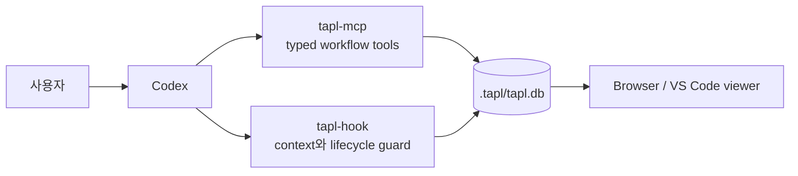

<p align="center">
  
</p>

# tapl

[English](README.md)

[](https://github.com/qkdxorjs1002/tapl/releases)
[](#필수-환경)
[](LICENSE.md)

**Codex 작업을 이어 주는 기록.** TAPL은 저장소마다 사용자 요청, 계획, 승인, 작업, 발견 사항, 작업 이력을 하나의 로컬 SQLite 데이터베이스에 보관합니다.

Codex에는 계속 평소처럼 작업을 요청하면 됩니다. TAPL이 진행 중인 작업을 조용히 보이게 하고, 나중에 찾을 수 있게 하며, 대화 맥락이 사라진 뒤에도 이어갈 수 있게 합니다.

[시작하기](#5분-빠른-시작) · [작업 흐름 보기](#매일의-사용-경험) · [설치 선택](#설치) · [viewer 열기](#viewer-열기)

## 왜 TAPL인가요?

오래 걸리는 에이전트 작업에서는 정작 중요한 맥락부터 잃기 쉽습니다.

| 이런 때 | TAPL이 주는 것 |
| --- | --- |
| 세션이 변경 중간에 끝남 | 현재 계획, 완료한 작업, 남은 일의 지속되는 기록 |
| 무엇을 승인하거나 수정했는지 확인해야 함 | 확인 가능한 승인, 수명 주기 이벤트, 발견 사항, 보관 기록 |
| 다음 세션이 과거 결정을 다시 찾아 헤맴 | 처음부터 시작하지 않는 저장소별 완료 작업 검색 |

그 결과 이전 프롬프트를 뒤지는 시간은 줄고, *Codex가 무엇을, 왜 하고 있으며 다음 세션은 어디서 이어야 하는가?*라는 질문의 답은 선명해집니다.

## 5분 빠른 시작

현재 v2 beta는 macOS에서 Homebrew로 가장 빠르게 시작할 수 있습니다.

```sh
brew tap qkdxorjs1002/tap
brew trust --formula qkdxorjs1002/tap/taplctl@pre
brew install taplctl@pre
taplctl install user --taplctl-command "$(brew --prefix taplctl@pre)/libexec/bin/taplctl"
```

그 다음에는 다음만 하면 됩니다.

1. TAPL MCP 서버와 hook을 읽도록 Codex를 재시작합니다.
2. Codex가 처음 확인을 요청하면 설치된 hook을 신뢰합니다.
3. 아무 저장소에서나 Codex에게 평소처럼 작업을 요청합니다.

TAPL은 작업 공간에 `.tapl/tapl.db`를 만들고, Codex는 `tapl-mcp`를 통해 계속 남는 작업 기록을 보관합니다. 작업 흐름을 기록하는 CLI 명령을 따로 배울 필요는 없습니다.

Linux와 Windows에서는 [TAPL을 Codex에 연결](#tapl을-codex에-연결)의 운영체제별 명령으로 실제 `taplctl` 실행 파일을 지정하세요.

## 매일의 사용 경험

원하는 결과를 Codex에게 요청하세요.

> 인증 흐름을 리팩터링하고, 기존 동작은 유지하며, 테스트로 검증해 줘.

Codex는 평소처럼 계획하고 작업합니다. 그 뒤에서 TAPL은 승인된 계획을 기록하고, 실행할 일을 작업으로 나누며, 발견 사항과 검증 상태를 보관하고, 결과를 저장합니다. 나중 세션은 이 기록을 직접 이어받을 수 있습니다.

<p align="center">
  
</p>

사용자가 하는 일은 간단합니다.

1. **Codex에게 평소처럼 요청합니다.** TAPL이 MCP로 작업 흐름의 규칙을 제공합니다.
2. **필요할 때 계획을 검토합니다.** 지속되는 파일 변경에는 여전히 기록된 승인이 필요합니다.
3. **작업을 지켜보거나 확인합니다.** 브라우저 또는 선택 사항인 VS Code viewer를 사용합니다.
4. **나중에 돌아옵니다.** Codex가 같은 저장소의 작업 이력을 이어서 찾습니다.

## 얻는 것

- **이어 할 수 있는 작업** — 계획, 작업, 승인, 발견 사항, 이벤트가 현재 대화보다 오래 남습니다.
- **저장소 안에 남는 상태** — 상태는 흩어진 전역 메모가 아니라 설명 대상 코드 옆의 `.tapl/tapl.db`에 있습니다.
- **찾을 수 있는 작업 이력** — SQLite 전문 검색은 항상 쓸 수 있고 시맨틱 검색은 선택 사항입니다.
- **보이는 진행 상황** — 로컬 브라우저 뷰어와 선택 사항인 VS Code 확장 기능이 실행 기록, 계획, 작업, 보관 기록을 보여 줍니다.
- **더 안전한 병렬 작업** — Codex 런타임이 실제 SubAgent를 관리하는 동안 TAPL은 의존성과 겹치지 않는 파일 소유 범위를 검증합니다.
- **분명한 자동화 인터페이스** — Codex는 형식화된 MCP 도구를, `taplctl`은 설치·진단·업데이트·뷰어용 작은 관리 CLI를 사용합니다.

## 설치

상황에 맞는 설치 경로를 고르세요.

| 환경 / 필요 | 권장 방법 |
| --- | --- |
| macOS, 전문 검색 | Homebrew `taplctl` |
| macOS, semantic search 포함 | Homebrew `taplctl-semantic` |
| macOS, 최신 안정판 또는 prerelease | Homebrew `taplctl@pre` |
| Linux | 독립형 `curl \| sh` installer |
| Windows 10 또는 11 | 독립형 PowerShell installer |

설치를 마친 뒤에는 [TAPL을 Codex에 연결](#tapl을-codex에-연결)하세요.

### 필수 환경

- `venv` 모듈을 포함한 Python 3.11 이상. Homebrew는 `python@3.12`를 사용합니다.
- FTS5와 extension loading을 지원하는 SQLite.
- formula 설치에는 Homebrew, source 개발에는 `uv`.
- Windows installer에는 Windows PowerShell 5.1 이상 또는 PowerShell 7.
- `taplctl viewer`에는 browser, 선택 extension에는 VS Code.

release wheel은 platform-independent이지만 Python dependency에는 호환되는 wheel이 필요합니다. 드문 architecture, 아주 새로운 Python release, Alpine 같은 musl Linux는 local build tool이 필요할 수 있습니다.

### macOS + Homebrew

tap을 한 번 추가하고 trust합니다.

```sh
brew tap qkdxorjs1002/tap
brew trust --formula qkdxorjs1002/tap/taplctl
```

formula는 정확히 하나만 설치하세요.

```sh
# 안정 release, 전문 검색
brew install taplctl

# 안정 release, semantic/vector search dependency 포함
brew install taplctl-semantic

# 공개된 최신 release: 안정판 또는 prerelease
brew trust --formula qkdxorjs1002/tap/taplctl@pre
brew install taplctl@pre
```

`taplctl`과 `taplctl-semantic`은 안정 release만 따릅니다. `taplctl@pre`는 prerelease여도 공개된 가장 최신 release를 따릅니다. 세 formula는 같은 executable을 설치하므로 함께 설치할 수 없습니다. 바꾸려면 먼저 현재 formula를 제거하세요. 예: `brew uninstall taplctl`.

Homebrew는 release-hosted wheel bundle의 고정 dependency를 설치하며, 설치 중 PyPI에서 package를 해석하지 않습니다.

<details>
<summary>Linux 독립형 installer</summary>

```sh
curl -fsSL https://raw.githubusercontent.com/qkdxorjs1002/tapl/main/install.sh | sh
```

installer에는 `curl`, Python 3.11+와 `venv`, 쓰기 가능한 install directory가 필요합니다. 기본값은 `${XDG_DATA_HOME:-$HOME/.local/share}/tapl`과 `${XDG_BIN_HOME:-$HOME/.local/bin}`입니다. 해당 XDG 변수 또는 `TAPL_INSTALL_ROOT`, `TAPL_BIN_DIR`로 바꿀 수 있습니다.

shell startup file이나 Codex hook은 수정하지 않습니다. 출력된 `PATH` export를 적용하고 필요하면 영구적으로 설정한 뒤, 아래에서 TAPL을 Codex에 연결하세요.

</details>

<details>
<summary>Windows 독립형 installer</summary>

```powershell
irm https://raw.githubusercontent.com/qkdxorjs1002/tapl/main/install.ps1 | iex
```

installer는 Windows 10/11, Windows PowerShell 5.1+ 또는 PowerShell 7, Python 3.11+와 `venv`, 쓰기 가능한 user directory를 지원합니다. 기본값은 `%LOCALAPPDATA%\tapl`, launcher는 `%LOCALAPPDATA%\tapl\bin\taplctl.cmd`입니다. `TAPL_INSTALL_ROOT`, `TAPL_BIN_DIR`, `TAPL_INSTALL_MANIFEST_URL`로 경로나 manifest를 바꿀 수 있습니다.

user `PATH`만 갱신하고 administrator 권한은 필요하지 않습니다. activation 전에 release manifest를 검증하고 wheel SHA-256을 확인합니다. Codex hook은 자동 설치하지 않습니다. 별도의 신뢰 절차가 필요한 환경이라면 script를 먼저 검토하세요.

</details>

### TAPL을 Codex에 연결

설치한 패키지에 맞는 명령으로 연결하세요. 현재 공개된 v2 `@pre`에서는
`tapl-hook`이 Homebrew의 public `bin` directory에 연결되지 않으므로, 명시적인
`libexec` 경로를 사용해야 installer가 같은 패키지의 `tapl-mcp`와 `tapl-hook`을
찾을 수 있습니다.

현재 v2 beta Homebrew formula(`taplctl@pre`):

```sh
taplctl install user --taplctl-command "$(brew --prefix taplctl@pre)/libexec/bin/taplctl"
```

현재 안정 `taplctl` 또는 `taplctl-semantic` 1.7 formula에도 위 명령의
`taplctl@pre`를 바꿔 넣을 수 있습니다. 다만 이 formula는 v2 전용 실행 파일이 아니라
해당 release의 호환 통합 경로를 사용합니다. 이후 formula update에서는 `tapl-hook`도
직접 연결하므로 그때부터는 `taplctl install user`만으로 충분합니다.

Linux 독립형 설치:

```sh
taplctl install user --taplctl-command "$(realpath "$(command -v taplctl)")"
```

Windows 독립형 설치:

```powershell
$taplRoot = if ($env:TAPL_INSTALL_ROOT) { $env:TAPL_INSTALL_ROOT } else { Join-Path $env:LOCALAPPDATA "tapl" }
$taplInstall = Get-Content -Raw (Join-Path $taplRoot "install.json") | ConvertFrom-Json
taplctl install user --taplctl-command (Join-Path $taplInstall.venv "Scripts\taplctl.exe")
```

위 명령은 Codex 계정 전체에 연결합니다. 현재 저장소에만 연결하려면 `user`를 `repo`로
바꾸세요.

이 명령은 `tapl-mcp`를 위한 활성화된 `mcp_servers.tapl` entry와 `tapl-hook` Codex
lifecycle hook을 추가합니다. 이후 Codex를 재시작하세요. Codex가 처음 확인을 요청하면
설치된 hook을 신뢰합니다.

<p align="center">
  
</p>

## TAPL 사용하기

### Viewer 열기

초기화된 workspace에서 실행합니다.

```sh
taplctl viewer
# tapl viewer: http://127.0.0.1:8000

taplctl viewer --port 9000  # 8000 포트가 사용 중일 때
```

viewer는 `127.0.0.1`에서만 listen하고 browser를 자동으로 열지 않으며 `Ctrl+C`로
종료합니다. 가장 가까운 `.tapl/tapl.db`가 선택됩니다. Homebrew login service처럼
workspace 없이 시작했다면 페이지가 초기화된 workspace folder를 물어보고, 성공한 최근
선택을 그 browser에 기억합니다.

설치한 Homebrew formula를 login 때 자동 시작하려면 `brew services start taplctl`,
`brew services start taplctl-semantic`, 또는 `brew services start taplctl@pre`를
사용하세요. 모든 service는 8000 포트에서 viewer를 제공합니다.

semantic formula는 preloaded search process를 의도적으로 시작하지 않습니다. 필요하면
`taplctl searchd start`와 `taplctl searchd status`를 실행하세요.

선택 VS Code extension은 workspace별 persistent `tapl-mcp` client를 사용합니다.
executable을 못 찾으면 `taplWorkflow.taplMcpPath`를 설정하세요.
`taplWorkflow.taplctlPath`는 sibling `tapl-mcp`를 찾는 legacy locator일 뿐 workflow
command path가 아닙니다.

### 재개와 검색

Codex는 typed MCP tool로 current state, archive detail, history를 읽습니다. SQLite FTS는
모든 설치에서 동작합니다. embedding/vector search에는 semantic extra 또는
`taplctl-semantic` formula를 설치하고, 기존 workspace의 index를 다시 만들 때는
`taplctl reindex`를 사용하세요.

### 병렬 작업

TAPL은 execution manifest를 조율하지만 worker를 spawn하지는 않습니다. Codex/root
runtime이 SubAgent를 만들고 관리합니다. 병렬 task는 dependency가 완료되고 서로 겹치지
않는 file 또는 directory를 소유할 때만 유효합니다. 기본적으로 순차 task는 main agent가
수행합니다.

## 동작 방식


```mermaid
flowchart LR
    U[사용자] --> C[Codex]
    C --> M[tapl-mcp<br/>typed workflow tools]
    C --> H[tapl-hook<br/>context와 lifecycle guard]
    M --> D[(.tapl/tapl.db)]
    H --> D
    D --> V[Browser / VS Code viewer]
```

`tapl-mcp`는 workflow application을 직접 호출하며 `taplctl` command나 CLI JSON data
plane을 감싸지 않습니다. `tapl-hook`은 Codex lifecycle 지점에서 간결한 current state를
더하고 durable-edit boundary를 지킵니다. SQLite database는 Codex, hook, viewer가 공유하는
source of truth입니다.

`taplctl`은 management-only입니다. 제공하는 것은 `init`, `doctor`, `update`, `install`,
`viewer`, `reindex`, `searchd`, `import-md`뿐입니다. agent는 workflow record를 만들거나,
dispatch·정산·검색·조회하려고 이 CLI를 사용해서는 안 됩니다.

## 설치 관리

| 명령 | 용도 |
| --- | --- |
| `taplctl init --workspace-root /path/to/workspace` | workspace root 선택 또는 초기화 |
| `taplctl doctor` | 설치와 workspace 문제 진단 |
| `taplctl install SCOPE --taplctl-command PATH` | Codex integration 설치 또는 갱신 |
| `taplctl viewer [--port 9000]` | local browser viewer 열기 |
| `taplctl update --check` / `update` | 독립형 설치 업데이트 확인 또는 실행 |
| `taplctl reindex` | search index 다시 만들기 |
| `taplctl searchd start` / `status` | 선택 semantic search process 관리 |
| `taplctl import-md PATH` | legacy Markdown workflow 가져오기 |

### 업데이트

Linux와 Windows 독립형 설치:

```sh
taplctl update --check
taplctl update
```

updater는 release manifest와 wheel SHA-256을 검증합니다. Homebrew와 source checkout은
업데이트하지 않습니다. Homebrew라면 설치한 formula에 맞춰 `brew update` 후
`brew upgrade taplctl`, `brew upgrade taplctl-semantic`, 또는 `brew upgrade taplctl@pre`를
사용하세요.

<details>
<summary>Workspace와 설치 설정</summary>

TAPL은 `.tapl/config.toml`을 `~/.tapl/config.toml`보다 먼저 읽습니다. database는
workspace anchor 역할도 합니다. 상위 database가 없으면 첫 hook이 payload working
directory를 초기화하고, nested Git repository는 가장 가까운 workspace database를
재사용합니다. 의도적으로 독립된 nested repository에는 그 안에서
`taplctl init --workspace-root PATH`를 실행해 별도 history를 만드세요.

installation은 관련 없는 Codex setting을 보존합니다. `hooks.json`은 managed merge되고,
`.codex/config.toml`은 기존 user value를 우선하는 TOML merge입니다. runtime config는 첫
install에 생성됩니다. upgrade 때 default overwrite 또는 누락 key merge를 물을 수
있습니다. TAPL managed template value를 우선하려면 `--force`를, runtime config policy를
명시하려면 `--tapl-config-policy {prompt,overwrite,merge}`를 사용하세요.

</details>

<details>
<summary>SubAgent delegation 설정</summary>

```toml
[subagents]
enabled = true

[subagents.models]
"gpt-5.6-sol" = ["xhigh", "max"]
"gpt-5.6-terra" = ["high", "xhigh", "max"]
```

활성화하면 TAPL은 delegation policy와 model/reasoning allowlist를 MCP instruction에
포함합니다. runtime은 이 allowlist 중 실제 지원하는 pair만 사용할 수 있습니다.
`enabled = false`로 TAPL의 delegation guidance를 빼도 `AGENTS.md` 같은 다른 source의
delegation instruction은 제거되지 않습니다.

plan/task policy는 고정입니다. 실행 작업은 상세 plan, 명시적인 plan confirmation,
독립적으로 나뉜 task, durable edit 전의 기록된 approval을 사용합니다.

</details>

### 문제 해결

| 증상 | 할 일 |
| --- | --- |
| Codex가 TAPL을 찾지 못함 | `taplctl doctor` 실행, 위 환경별 연결 명령으로 갱신 후 Codex 재시작 |
| 독립형 설치 뒤 `taplctl`을 찾지 못함 | installer가 출력한 `PATH` export를 적용하고 shell profile에 추가 |
| viewer가 workspace를 찾지 못함 | 초기화하거나 `.tapl/tapl.db`가 있는 folder를 선택 |
| 8000 포트 사용 중 | Homebrew service를 멈추거나 `taplctl viewer --port PORT` 실행 |
| Homebrew formula 충돌 | 다른 formula를 선택하기 전에 설치된 TAPL formula 제거 |

`TAPL_ENABLE_LEGACY_WORKFLOW_CLI=1`은 지원되지 않는 migration 또는 diagnostic에만
retired workflow CLI를 임시로 노출합니다. 일반 interface가 아니며 agent, script,
viewer가 사용해서는 안 됩니다.

## 개발

```sh
uv --directory tapl sync --extra test
uv --directory tapl run --extra test python -m unittest discover -s tests
uv --directory tapl build
npm --prefix vscode-extension run compile
git diff --check
```

semantic search를 개발할 때는 `uv --directory tapl sync --extra semantic`을 사용하세요.

## 라이선스

MIT. [LICENSE.md](LICENSE.md)를 참고하세요.
