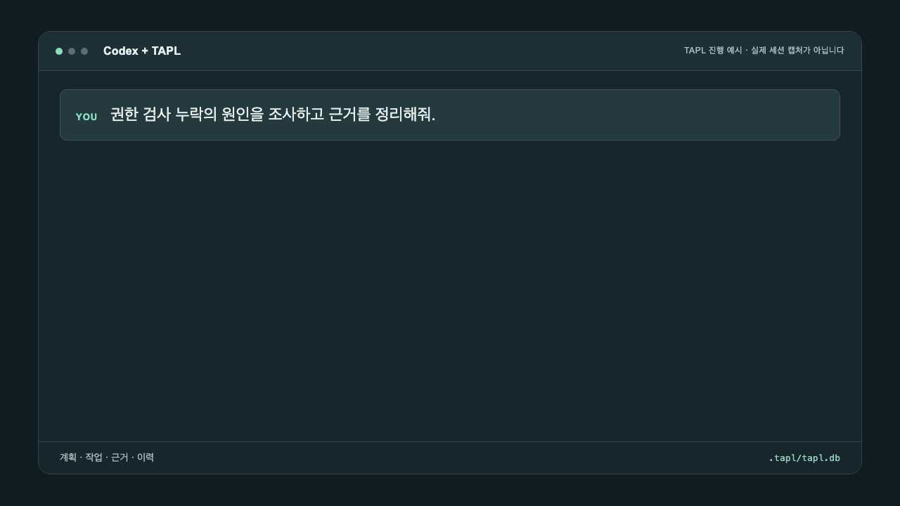
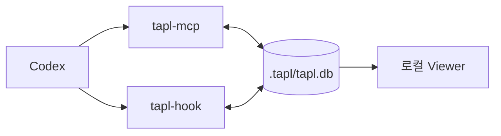

<p align="center">
  
</p>
<h1 align="center">tapl</h1>
<p align="center"><strong>코딩 에이전트에게 기억을.</strong></p>
<p align="center">요청부터 계획, 발견 사항, 완료 기록까지 코드 옆에 남겨 다음 세션에서도 이어갑니다.</p>

<p align="center">
  <a href="README.md">English</a> · <strong>한국어</strong>
</p>
<p align="center">
  <a href="https://github.com/qkdxorjs1002/tapl/releases"></a>
  <a href="docs/guide.ko.md#requirements"></a>
  <a href="LICENSE.md"></a>
</p>
<p align="center">
  <a href="#quick-start">빠른 시작</a> · <a href="#associative-memory">연상 기억</a> · <a href="#workflow">진행 예시</a> · <a href="docs/guide.ko.md">설치·운영 가이드</a>
</p>

## 왜 TAPL인가요?

대화가 길어지거나 세션이 바뀌어도, 작업의 맥락은 저장소에 남아 있어야 합니다.
TAPL은 Codex의 요청, 계획, 승인, 작업, 발견 사항과 이력을 로컬 SQLite 데이터베이스에 보관합니다.

- **중단한 곳에서 이어갑니다.** 완료한 일과 남은 일을 다시 설명할 필요가 줄어듭니다.
- **코드 옆에 기록합니다.** 저장소의 `.tapl/tapl.db`에 작업 상태와 근거가 함께 남습니다.
- **이전 결정을 찾습니다.** 전문 검색을 기본 제공하며, 시맨틱 검색을 선택할 수 있습니다.
- **관련 경험을 떠올립니다.** 연상 기억이 과거 작업의 짧은 단서를 제공하고 원본 기록으로 연결합니다.
- **진행 상황을 확인합니다.** 대화의 단계별 안내와 로컬 viewer로 계획과 작업 상태를 살펴봅니다.
- **병렬 작업의 경계를 정합니다.** 작업 의존성과 파일 소유 범위를 확인해 위임을 조율합니다.

<a id="associative-memory"></a>

## 연상 기억

“그때 이렇게 구현했던 것 같은데…”라는 생각이 관련 자료를 다시 찾게 하듯,
TAPL의 연상 기억은 현재 작업과 과거 기록 사이를 이어 주는 짧은 단서입니다.
에이전트는 단서에서 출발해 원본을 확인하고, 지금 작업에 적용할 수 있는지 판단합니다.

예를 들어 마이그레이션을 수정할 때 “이전에는 트랜잭션 경계를 확인했었지”라는
기억이 떠오르면, 연결된 작업 기록을 열어 당시 구현과 검증 결과를 확인할 수 있습니다.

1. **남길 경험을 고릅니다.** 작업 완료 시 검증한 결정, 재사용할 해결법, 주의점 등을 최대 2개 기록할 수 있습니다. 각 기억은 240자 이하 메모, 단서 3–5개, 원본 작업이나 기록의 참조로 구성됩니다.
2. **필요할 때 떠올립니다.** 새 작업을 정리할 때 한 번, 관련 단서를 최대 3개 컨텍스트에 제공합니다. 에이전트는 연결된 원문을 확인한 뒤 활용합니다.
3. **실제로 쓰인 기억을 강화합니다.** 원문을 확인하고 작업에 사용했다고 기록한 기억은 더 오래 유지됩니다. 단순히 보거나 검색한 것만으로는 강화되지 않습니다.

사용하지 않는 기억의 강도는 서서히 줄어들지만, 오래됐다는 이유만으로 삭제되지는 않습니다.
기존 SQLite와 전문 검색을 사용하므로 별도 임베딩 모델이나 상주 프로세스 없이 동작합니다.

웹·VS Code Viewer에서 기억의 목록·검색·상세·원문을 조회할 수 있습니다.
기억을 수정하거나 삭제하려면 에이전트에게 명시적으로 요청하세요.

자동 기록·회상·강화는 기본으로 켜져 있습니다. 수동 조회·관리는 유지하면서 끄려면:

```sh
taplctl config set recall.enabled false
# 기본값으로 복원:
taplctl config unset recall.enabled
```

세부 기준과 제한은 [연상 기억 안내](docs/guide.ko.md#연상-기억)를 참고하세요.

<a id="workflow"></a>

## 작업 흐름 보기

Codex에게 평소처럼 요청하세요.

> 권한 검사 누락의 원인을 조사하고 근거를 정리해줘.

한 요청에 독립적인 주제가 여러 개 있으면 Codex는 하나의 RUN 안에 주제별 PLAN을 모두 작성한 뒤 TASK를 설계합니다. 예를 들어 아래 네 주제를 함께 요청하면 다음처럼 나눕니다.

| PLAN | 주제 |
| --- | --- |
| PLAN-001 | 불규칙 호스트명 정규식 필터링 |
| PLAN-002 | 분석용 기본 Codex CLI 환경 |
| PLAN-003 | 모델 추론 레벨 설정 |
| PLAN-004 | 웹 페이지 요소를 통한 광고 탐지 |

각 PLAN은 자체 요구사항·접근 방식·검증을 담고, 각 TASK는 `spec_id`로 해당 주제의 PLAN을 참조합니다. 한 결과를 위한 단계·제약·예시·테스트는 함께 유지합니다. 별도 RUN 수명주기는 사용자가 명시적으로 요청할 때만 나눕니다.

<p align="center">
  
</p>

[정적인 전체 예시 보기](assets/readme/workflow-ko.png)

위 화면은 **공개 진행 메시지를 재구성한 예시**이며 실제 세션 캡처가 아닙니다.
에이전트가 알리는 단계와 기록하는 근거, 작업 상태를 순서대로 보여 줍니다.

| 단계 | 이 예시에서 하는 일 |
| --- | --- |
| `RUN` | 요청을 `Investigation · Strict · Planned`로 분류합니다. |
| `HISTORY` | 관련된 이전 작업과 결정을 찾습니다. |
| `PLAN` | 권한 검사 호출 경로와 확인할 근거를 조사 계획에 정리합니다. |
| `TASK` | 계획에 따라 권한 검사 경로를 조사합니다. |
| `FINDING` | 확인한 원인과 근거를 기록합니다. |
| `ARCHIVE` | 결과를 보관해 다음 세션에서 찾을 수 있게 합니다. |

`RUN → HISTORY → PLAN → TASK → FINDING → ARCHIVE`는 이 조사 예시의 순서입니다.
권한과 관련된 조사이므로 `Strict`, 계획과 작업 기록을 사용하는 흐름이므로 `Planned`입니다.
모든 요청이 이 단계를 거치는 것은 아닙니다. 간단한 읽기 전용 요청은 더 적은 단계로 끝날 수 있습니다.
수정·테스트·구현·검증을 직접 요청하는 것도 실행 승인에 해당합니다.

<a id="quick-start"></a>

## 빠른 시작

macOS에서는 Homebrew로 안정판을 설치하고 Codex에 연결합니다.

```sh
brew tap qkdxorjs1002/tap
brew trust --formula qkdxorjs1002/tap/taplctl
brew install taplctl
taplctl install user
```

1. TAPL MCP 서버와 hook을 읽도록 **Codex를 재시작**합니다.
2. Codex가 처음 확인을 요청하면 **설치된 hook을 신뢰**합니다.
3. 저장소에서 **평소처럼 작업을 요청**합니다.

TAPL이 작업 공간에 `.tapl/tapl.db`를 만들고, Codex가 MCP를 통해 기록을 관리합니다.
작업을 기록하기 위한 CLI 명령을 따로 익힐 필요는 없습니다.

[Linux 설치](docs/guide.ko.md#linux)와 [Windows 설치](docs/guide.ko.md#windows)는 가이드를 참고하세요.
설치 후 [운영체제별 Codex 연결 명령](docs/guide.ko.md#connect)을 실행합니다.

## 설치

| 플랫폼·채널 | 설치 방법 | 안내 |
| --- | --- | --- |
| macOS · 안정판 | Homebrew `taplctl` | [전문 검색 포함](docs/guide.ko.md#homebrew) |
| macOS · 안정판 + 시맨틱 검색 | Homebrew `taplctl-semantic` | [선택 의존성 포함](docs/guide.ko.md#homebrew) |
| macOS · 프리릴리즈 포함 최신 채널 | Homebrew `taplctl-pre` | [채널 선택](docs/guide.ko.md#homebrew) |
| Linux · 안정판 기본 | 독립형 셸 설치 스크립트 | [설치 및 경로 설정](docs/guide.ko.md#linux) |
| Windows 10/11 · 안정판 기본 | 독립형 PowerShell 설치 스크립트 | [설치 및 경로 설정](docs/guide.ko.md#windows) |

Python 3.11 이상이 필요합니다. Homebrew의 세 formula는 서로 충돌하므로 하나만 설치하세요.
자세한 의존성, 업데이트, 설정은 [설치·운영 가이드](docs/guide.ko.md)에서 확인할 수 있습니다.

## Viewer 열기

웹과 VS Code 확장은 같은 Viewer 화면·기능·메시지 타입을 공유합니다. 웹은 확장 기준의 중립적인 기본 색상을 사용하고, 확장에서는 현재 VS Code 테마가 우선 적용됩니다.

연상 기억의 목록·검색·상세·원본을 확인할 수 있습니다. Viewer는 읽기 전용이며,
기억 수정이나 삭제가 필요하면 Agent에게 지시합니다.
저장 기준과 반복 사용에 따른 강화는 [연상 기억 안내](docs/guide.ko.md#연상-기억)를 참고하세요.

초기화된 저장소에서 실행하세요.

```sh
taplctl viewer
# http://127.0.0.1:8000
```

브라우저에서 [127.0.0.1:8000](http://127.0.0.1:8000)을 직접 열면 계획, 작업, 발견 사항과 이력을 볼 수 있습니다.
브라우저는 자동으로 열리지 않으며, `Ctrl+C`로 viewer를 종료합니다.

8000 포트가 사용 중이면 `taplctl viewer --port 9000`을 사용하세요.
작업 공간 없이 시작하면 viewer에서 초기화된 저장소 폴더를 선택할 수 있습니다.
서비스 자동 시작과 리버스 프록시는 [Viewer 운영 안내](docs/guide.ko.md#viewer)를 참고하세요.

VS Code에서도 [선택 확장 기능](vscode-extension/README.md)으로 작업 기록을 볼 수 있습니다.

## 동작 방식


```mermaid
flowchart LR
    A[Codex] --> B[tapl-mcp]
    A --> C[tapl-hook]
    B <--> D[(.tapl/tapl.db)]
    C <--> D
    D --> E[로컬 Viewer]
```

- **`tapl-mcp`**가 워크플로 기록 생성, 조회, 검색과 작업 상태 관리를 수행합니다.
- **`tapl-hook`**이 Codex의 수명 주기 지점에 현재 상태를 전달하고 실행 승인 경계를 확인합니다.
- **`taplctl`**은 설치, 진단, 업데이트, 설정과 viewer 등 관리 작업을 담당합니다.

SQLite 데이터베이스가 이 구성 요소들이 공유하는 작업 기록의 기준입니다.
SubAgent의 생성과 관리는 Codex 런타임이 담당하고, TAPL은 의존성과 실행 범위를 조율합니다.
[위임 설정과 프로필](docs/guide.ko.md#subagents)에서 동작을 조정할 수 있습니다.

## 문서

- [설치·운영 가이드](docs/guide.ko.md) — 플랫폼별 설치, 업데이트, 설정, 문제 해결
- [VS Code 확장 기능](vscode-extension/README.md) — 편집기에서 작업 기록 보기
- [GitHub Issues](https://github.com/qkdxorjs1002/tapl/issues) — 버그 신고와 기능 제안

## 개발

### 워크플로우 지침 전달

MCP 초기화는 짧은 필수 bootstrap을 제공합니다. agent는 작업 전에 `tapl_get_next`에서
권위 있는 전체 `workflow_policy`, `subagent_guidance`, `config`를 읽습니다. 기존 지침
원문과 승인·계획·작업·위임·검증·복구·아카이브 규칙은 그대로 유지합니다.

응답의 `policy_revision`은 전달한 정책·지침·설정 전체를 식별합니다. 호출자는 **해당
내용 전체를 현재 컨텍스트에서 사용할 수 있을 때만** 이를 `known_policy_revision`으로
전달할 수 있습니다. 같은 revision이면 변경 없는 필드만 생략하며, 다음 행동과 모델
catalog 검사는 항상 새로 계산합니다. 알 수 없는 revision, 정책·설정 변경, 모델 catalog
변경에는 전체 내용을 반환합니다. 새 세션, 컨텍스트 압축 후, 내용 유지가 불확실한 때에는
revision을 생략해야 하며 요약만으로는 충분하지 않습니다. 이 선택 인자 없이 호출하면
항상 전체 내용을 받습니다.

상태 조회는 트랜잭션 안에서 읽은 동일 snapshot을 검증에 사용합니다. 쓰기 영수증은
최신 다음 행동을 계속 제공하면서 응답에서 버릴 정책 문구의 생성만 생략합니다.
실행 승인과 원자적 dispatch/settlement 검사는 변경하지 않습니다.

저장소 루트에서 실행합니다.

```sh
uv --directory tapl sync --extra test
uv --directory tapl run --extra test python -m unittest discover -s tests
uv --directory tapl build
npm --prefix vscode-extension run compile
git diff --check
```

시맨틱 검색을 개발할 때는 `uv --directory tapl sync --extra semantic`을 사용하세요.

## 라이선스

[MIT](LICENSE.md)
