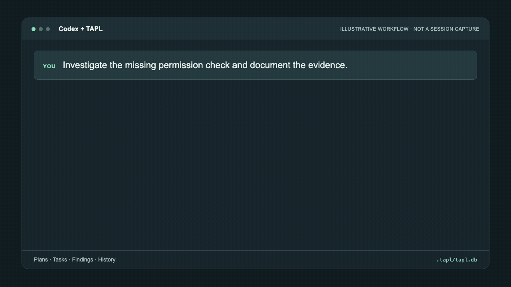
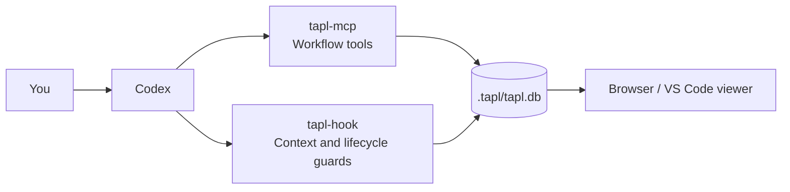

<p align="center">
  
</p>
<h1 align="center">tapl</h1>
<p align="center"><strong>Give your coding agent a memory.</strong></p>
<p align="center">TAPL keeps your Codex plans, approvals, tasks, findings, and history in a repository-local SQLite database.</p>
<p align="center"><strong>English</strong> · <a href="README.ko.md">한국어</a></p>
<p align="center">
  <a href="https://github.com/qkdxorjs1002/tapl/releases"></a>
  <a href="docs/guide.md#requirements"></a>
  <a href="LICENSE.md"></a>
</p>
<p align="center"><a href="#quick-start">Quick start</a> · <a href="#workflow">Workflow</a> · <a href="docs/guide.md">Guide</a></p>

## Why TAPL?

Keep asking Codex to work normally. TAPL makes that work visible while it happens
and recoverable when the conversation ends.

- **Resume with context.** Recover the plan, completed tasks, and remaining work in a later session.
- **Keep decisions close to the code.** Each workspace owns its history in `.tapl/tapl.db`.
- **See what happened.** Inspect approvals, findings, validation, and lifecycle events.
- **Search previous work.** Full-text search is included; semantic search is optional.
- **Coordinate parallel tasks.** Track dependencies and exclusive file ownership while Codex manages the agents.

<a id="workflow"></a>

## See the workflow

Ask for an outcome, in your own words:

> Investigate the missing permission check and document the evidence.

The example below traces the permission-check call path, records the evidence,
and saves the investigation with its follow-up work.

<p align="center">
  
</p>

[View the still image](assets/readme/workflow-en.png)

This is an illustrative sequence of public progress messages, not a captured
session. It uses **Investigation · Strict · Planned** for this permission/security
scenario; other requests can take fewer stages. An explicit request to edit or
test already counts as approval for that work.

The durable record follows **RUN → HISTORY → PLAN → TASK → FINDING → ARCHIVE**:
start the work, recover relevant context, record the plan, track execution,
preserve the evidence, and leave a result the next session can use.

<a id="quick-start"></a>

## Quick start

On macOS with Homebrew, install the stable release and connect it to Codex:

```sh
brew tap qkdxorjs1002/tap
brew trust --formula qkdxorjs1002/tap/taplctl
brew install taplctl
taplctl install user
```

1. **Restart Codex** to load the TAPL MCP server and lifecycle hooks.
2. **Trust the installed hook** when Codex first asks.
3. **Open a repository and ask normally.** Codex records the work through TAPL.

TAPL creates `.tapl/tapl.db` for the workspace. You do not need to write workflow
records by hand or learn another set of task-management commands.

Using Linux, Windows, or another release channel? Choose an option below and
follow its [Codex connection command](docs/guide.md#connect).

## Installation

| Platform / channel | Install option | Details |
| --- | --- | --- |
| Homebrew · stable | `taplctl` | [Full-text search](docs/guide.md#homebrew) |
| Homebrew · stable + semantic | `taplctl-semantic` | [Embedding and vector dependencies](docs/guide.md#homebrew) |
| Homebrew · newest published release | `taplctl-pre` | [May include prereleases](docs/guide.md#homebrew) |
| Linux | Standalone shell installer | [Setup and paths](docs/guide.md#linux) |
| Windows 10 / 11 | Standalone PowerShell installer | [Setup and paths](docs/guide.md#windows) |

Install only one Homebrew formula at a time; they share the same executables.
Standalone installers default to the latest stable release. See the guide for
[requirements](docs/guide.md#requirements), [updates](docs/guide.md#updates), and
[troubleshooting](docs/guide.md#troubleshooting).

## Open the viewer

From your workspace, start the local viewer:

```sh
taplctl viewer
# tapl viewer: http://127.0.0.1:8000
```

Open **<http://127.0.0.1:8000>** in your browser to inspect runs, plans, tasks,
findings, archives, and associative memories. Memory screens support read-only
list, search, detail, and original-source inspection. Ask the agent explicitly to
edit or delete a memory through MCP. The command does not open a browser automatically;
press `Ctrl+C` to stop it.

Use `taplctl viewer --port 9000` if port 8000 is busy. If no workspace is selected,
the viewer asks for an initialized workspace folder.

For login services, reverse proxies, and the optional VS Code viewer, see
[viewer setup](docs/guide.md#viewer).

## Associative memory

TAPL can keep up to two short, verified lessons per completed run and emit up to
three relevant hints once when a new run is summarized. Hints point to original
records; the agent checks those sources before relying on them. Useful memories
strengthen only after confirmed use. Unused memories gradually fade.

Automatic capture, recall, and reinforcement are enabled by default. To disable
them while keeping manual inspection and management available:

```sh
taplctl config set recall.enabled false
# Restore the default:
taplctl config unset recall.enabled
```

## How it works



**`tapl-mcp`** exposes typed workflow tools. **`tapl-hook`** supplies current state
and checks lifecycle boundaries. Both use the same local database as the viewers.

**`taplctl`** manages installation, configuration, diagnostics, updates, and local
services. Workflow records go through MCP; the CLI is not a workflow data API.
TAPL tracks execution ownership and dependencies; the Codex runtime spawns and
manages SubAgents.

## Documentation

- [User guide](docs/guide.md) — installation, configuration, search, services, and SubAgent preferences.
- [VS Code extension](vscode-extension/README.md) — workspace viewer setup and usage.
- [Issues](https://github.com/qkdxorjs1002/tapl/issues) — report a bug or request a feature.

## Development

```sh
uv --directory tapl sync --extra test
uv --directory tapl run --extra test python -m unittest discover -s tests
uv --directory tapl build
npm --prefix vscode-extension run compile
git diff --check
```

For semantic search development:

```sh
uv --directory tapl sync --extra semantic
```

## License

MIT. See [LICENSE.md](LICENSE.md).
