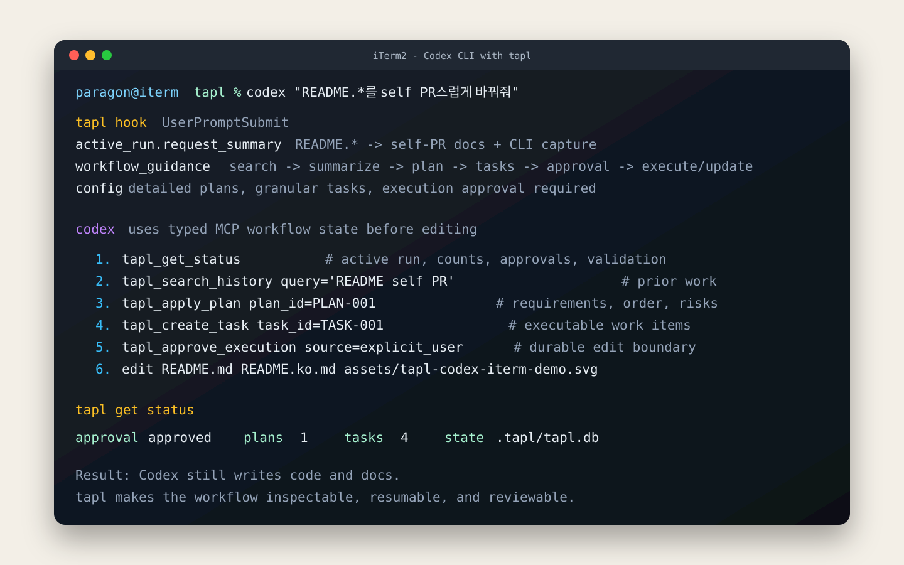
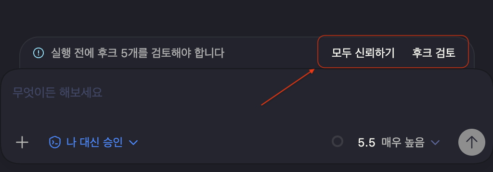
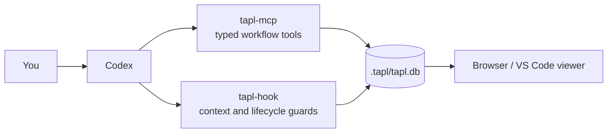

<p align="center">
  
</p>

# tapl

[한국어](README.ko.md)

[](https://github.com/qkdxorjs1002/tapl/releases)
[](#requirements)
[](LICENSE.md)

**Durable workflow memory for Codex.** TAPL keeps the request, plan, approvals, tasks, findings, and history for each repository in one local SQLite database.

You keep asking Codex to work normally. TAPL quietly makes the work visible while it happens, searchable later, and resumable after the chat context is gone.

[Get started](#5-minute-quick-start) · [See the workflow](#what-daily-use-feels-like) · [Choose an installation](#installation) · [Open the viewer](#open-the-viewer)

## Why TAPL?

Long-running agent work often loses the exact context that matters most:

| When this happens | TAPL gives you |
| --- | --- |
| A session ends halfway through a change | A durable record of the current plan, completed tasks, and remaining work |
| You need to know what was approved or edited | Inspectable approvals, lifecycle events, findings, and archives |
| A later session starts rediscovering old decisions | Repository-local search across completed work instead of starting over |

The result is less prompt archaeology and a clearer answer to: *What is Codex doing, why is it doing it, and where should the next session continue?*

## 5-minute quick start

TAPL v2 is currently in beta, so the fastest setup on macOS uses the prerelease Homebrew channel:

```sh
brew tap qkdxorjs1002/tap
brew trust --formula qkdxorjs1002/tap/taplctl@pre
brew install taplctl@pre
taplctl install user --taplctl-command "$(brew --prefix taplctl@pre)/libexec/bin/taplctl"
```

Then:

1. Restart Codex so it loads the TAPL MCP server and hooks.
2. Trust the installed hook when Codex asks for confirmation the first time.
3. Open any repository and ask Codex to work as usual.

TAPL creates `.tapl/tapl.db` for the workspace and Codex records durable work through `tapl-mcp`. You do not need to learn workflow-writing CLI commands.

On Linux or Windows, start with the matching option in [Installation](#installation), then use its package-specific command under [Connect TAPL to Codex](#connect-tapl-to-codex).

## What daily use feels like

Ask for the outcome you want:

> Refactor the authentication flow, keep existing behavior, and verify the tests.

Codex plans and executes the work normally. Behind the scenes, TAPL records the approved plan, splits executable work into tasks, keeps findings and validation state, and archives the result. A later session can recover that state directly.

<p align="center">
  
</p>

The workflow stays simple from your side:

1. **Ask Codex normally.** TAPL supplies the workflow contract through MCP.
2. **Review the plan when needed.** Durable edits still require recorded approval.
3. **Watch or inspect the work.** Use the browser or optional VS Code viewer.
4. **Return later.** Codex can resume and search the same repository history.

## What you get

- **Resumable work** — Plans, tasks, approvals, findings, and events survive the current conversation.
- **Repository-local ownership** — State lives in `.tapl/tapl.db`, beside the work it describes, rather than in loose global notes.
- **Searchable history** — SQLite full-text search is always available; semantic search is optional.
- **Visible progress** — The local browser viewer and optional VS Code extension show runs, plans, tasks, and archives.
- **Safer parallel work** — TAPL validates dependencies and non-overlapping file ownership while the Codex runtime manages the actual SubAgents.
- **A clean agent interface** — Codex uses typed MCP tools; `taplctl` remains a small management CLI for installation, diagnosis, updates, and viewers.

## Installation

Choose one installation path:

| Platform / need | Recommended option |
| --- | --- |
| full-text search | Homebrew `taplctl` |
| semantic search included | Homebrew `taplctl-semantic` |
| newest stable or prerelease | Homebrew `taplctl@pre` |
| Linux | Standalone `curl \| sh` installer |
| Windows 10 or 11 | Standalone PowerShell installer |

After any installation, [connect TAPL to Codex](#connect-tapl-to-codex).

### Requirements

- Python 3.11 or newer with the `venv` module. Homebrew uses `python@3.12`.
- SQLite with FTS5 and extension loading support.
- Homebrew for a formula installation; `uv` for source development.
- Windows PowerShell 5.1 or newer, or PowerShell 7, for the Windows installer.
- A browser for `taplctl viewer`; VS Code only for the optional extension.

The release wheel is platform-independent, but its Python dependencies still need compatible wheels. Uncommon architectures, very new Python releases, and musl-based Linux distributions such as Alpine may require local build tools.

### Homebrew

Add and trust the tap once:

```sh
brew tap qkdxorjs1002/tap
brew trust --formula qkdxorjs1002/tap/taplctl
```

Install exactly one formula:

```sh
# Stable release, full-text search
brew install taplctl

# Stable release, semantic/vector search dependencies included
brew install taplctl-semantic

# Newest published release, stable or prerelease
brew trust --formula qkdxorjs1002/tap/taplctl@pre
brew install taplctl@pre
```

`taplctl` and `taplctl-semantic` follow stable releases. `taplctl@pre` follows the newest published release even when that release is a prerelease. All three formulae install the same executables and cannot coexist. Before switching, uninstall the current formula—for example, `brew uninstall taplctl`.

Homebrew installs pinned dependencies from release-hosted wheel bundles and does not resolve packages from PyPI during installation.

<details>
<summary>Linux standalone installer</summary>

```sh
curl -fsSL https://raw.githubusercontent.com/qkdxorjs1002/tapl/main/install.sh | sh
```

The installer needs `curl`, Python 3.11+ with `venv`, and writable installation directories. Its defaults are `${XDG_DATA_HOME:-$HOME/.local/share}/tapl` and `${XDG_BIN_HOME:-$HOME/.local/bin}`; override them with the corresponding XDG variables or `TAPL_INSTALL_ROOT` and `TAPL_BIN_DIR`.

It does not modify shell startup files or install Codex hooks. Apply any printed `PATH` export, make it persistent if needed, then connect TAPL to Codex below.

</details>

<details>
<summary>Windows standalone installer</summary>

```powershell
irm https://raw.githubusercontent.com/qkdxorjs1002/tapl/main/install.ps1 | iex
```

The installer supports Windows 10 and 11 with Windows PowerShell 5.1+ or
PowerShell 7, Python 3.11+ with `venv`, and per-user writable directories. It
defaults to `%LOCALAPPDATA%\tapl` with a launcher at
`%LOCALAPPDATA%\tapl\bin\taplctl.cmd`. Override the paths or manifest with
`TAPL_INSTALL_ROOT`, `TAPL_BIN_DIR`, or `TAPL_INSTALL_MANIFEST_URL`.

It updates only the user `PATH`, requires no administrator privileges, validates
the release manifest, and verifies the wheel SHA-256 before activation. It does
not install Codex hooks. Review the script first if your environment requires a
different trust process.

</details>

### Connect TAPL to Codex

Connect with the command for the package you installed. For the currently
published v2 `@pre`, the explicit libexec path lets the installer find the
dedicated sibling `tapl-mcp` and `tapl-hook` executables even though
`tapl-hook` is not linked into Homebrew's public `bin` directory.

Homebrew (`taplctl@pre`):

```sh
taplctl install user --taplctl-command "$(brew --prefix taplctl@pre)/libexec/bin/taplctl"
```

The same substitution works with the current stable `taplctl` and
`taplctl-semantic` 1.7 formulae, but they use that release's compatibility
integration rather than dedicated v2 executables. Future formula updates link
`tapl-hook` directly as well, after which `taplctl install user` is sufficient.

Linux standalone installer:

```sh
taplctl install user --taplctl-command "$(realpath "$(command -v taplctl)")"
```

Windows standalone installer (PowerShell):

```powershell
$taplRoot = if ($env:TAPL_INSTALL_ROOT) { $env:TAPL_INSTALL_ROOT } else { Join-Path $env:LOCALAPPDATA "tapl" }
$taplInstall = Get-Content -Raw (Join-Path $taplRoot "install.json") | ConvertFrom-Json
taplctl install user --taplctl-command (Join-Path $taplInstall.venv "Scripts\taplctl.exe")
```

These commands install for your Codex account. Replace `user` with `repo` to connect only the current repository.

This adds an enabled `mcp_servers.tapl` entry for `tapl-mcp` and Codex lifecycle hooks for `tapl-hook`. Restart Codex afterward. The first time Codex asks for confirmation, trust the installed hook.

<p align="center">
  
</p>

## Use TAPL

### Open the viewer

From an initialized workspace:

```sh
taplctl viewer
# tapl viewer: http://127.0.0.1:8000

taplctl viewer --port 9000  # when port 8000 is busy
```

The viewer listens only on `127.0.0.1`, does not open a browser automatically,
and stops with `Ctrl+C`. The nearest `.tapl/tapl.db` is selected. If no workspace
is available—for example, when started as a Homebrew login service—the page asks
for an initialized workspace folder and remembers the last successful choice in
that browser.

When a trusted reverse proxy or tunnel publishes the viewer at another origin,
allow that exact browser origin explicitly:

```sh
taplctl viewer --allowed-origin https://tapl.example.com
```

For a persistent service, add the origins to `~/.tapl/config.toml` and restart
the matching Homebrew service:

```toml
[viewer]
allowed_origins = [
  "https://tapl.example.com",
  "https://tapl.internal.example",
]
```

```sh
brew services restart taplctl
```

The value must contain only the HTTP(S) scheme, host, and optional port. Repeat
`--allowed-origin` or use the configuration array to allow more than one origin.
CLI and configuration origins are combined. TAPL continues to listen only on
loopback; the proxy should handle authentication and TLS. Avoid wildcard origin
rules when the viewer is reachable from an untrusted network.

Start the installed Homebrew formula automatically at login with
`brew services start taplctl`, `brew services start taplctl-semantic`, or
`brew services start taplctl@pre`. Each service serves the viewer on port 8000.

The semantic formula intentionally does not start a preloaded search process.
Run `taplctl searchd start` and `taplctl searchd status` when you want one.

The optional VS Code extension uses a persistent workspace-scoped `tapl-mcp`
client. Set `taplWorkflow.taplMcpPath` if it cannot locate the executable.

### Resume and search

Codex reads current state, archive details, and history through typed MCP tools.
SQLite FTS works in every installation. Install the semantic extra—or the
`taplctl-semantic` formula—for embedding and vector search, then use
`taplctl reindex` when an existing workspace needs its index rebuilt.

### Parallel work

TAPL coordinates execution manifests; it does not spawn workers. The Codex/root
runtime creates and manages SubAgents. Parallel tasks are valid only when their
dependencies are complete and they own non-overlapping files or directories.
Sequential tasks remain on the main agent by default.

## How it works



`tapl-mcp` calls the workflow application directly; it does not wrap
`taplctl` commands or use a CLI JSON data plane. `tapl-hook` adds concise current
state at Codex lifecycle points and guards durable-edit boundaries. The SQLite
database is the shared source of truth for Codex, hooks, and viewers.

`taplctl` is management-only. Its seven public commands are `init`, `doctor`,
`update`, `install`, `viewer`, `reindex`, and `searchd`. Agents should never use
it to create, dispatch, settle, search, or inspect workflow records.

## Manage your installation

| Command | Purpose |
| --- | --- |
| `taplctl init --workspace-root /path/to/workspace` | Select or initialize a workspace root |
| `taplctl doctor` | Diagnose installation and workspace problems |
| `taplctl install SCOPE --taplctl-command PATH` | Install or refresh Codex integration |
| `taplctl viewer [--port 9000]` | Open the local browser viewer |
| `taplctl update --check` / `update` | Check or update standalone installations |
| `taplctl reindex` | Rebuild search indexes |
| `taplctl searchd start` / `status` | Manage the optional semantic search process |

### Updates

For Linux and Windows standalone installations:

```sh
taplctl update --check
taplctl update
```

The updater validates the release manifest and wheel SHA-256. It does not update
Homebrew or source checkouts. For Homebrew, use `brew update` followed by
`brew upgrade taplctl`, `brew upgrade taplctl-semantic`, or
`brew upgrade taplctl@pre`, matching the installed formula.

<details>
<summary>Workspace and installation settings</summary>

TAPL loads repo-local `.tapl/config.toml` before `~/.tapl/config.toml`. A database
also acts as the workspace anchor: the first hook initializes the payload working
directory if no ancestor database exists, and nested Git repositories reuse the
nearest workspace database. Run `taplctl init --workspace-root PATH` inside a
deliberately independent nested repository to give it separate history.

Installation preserves unrelated Codex settings. `hooks.json` is managed-merged,
and `.codex/config.toml` is TOML-merged with existing user values taking
precedence. Runtime config is created on first install; upgrades can prompt to
overwrite defaults or merge missing keys. Use `--force` for TAPL-managed template
values to win, or `--tapl-config-policy {prompt,overwrite,merge}` to select the
runtime config policy explicitly.

</details>

<details>
<summary>SubAgent delegation settings</summary>

```toml
[subagents]
enabled = true

[subagents.models]
"gpt-5.6-sol" = ["xhigh", "max"]
"gpt-5.6-terra" = ["high", "xhigh", "max"]
```

When enabled, TAPL includes its delegation policy and configured model/reasoning
allowlist in MCP instructions. The runtime may use only supported pairs in that
allowlist. Set `enabled = false` to omit TAPL's delegation guidance; this does not
remove delegation instructions from another source such as `AGENTS.md`.

Plan and task policy is fixed: executable work uses detailed planning, explicit
plan confirmation, independently split tasks, and recorded approval before
durable edits.

</details>

### Troubleshooting

| Symptom | What to do |
| --- | --- |
| Codex does not see TAPL | Run `taplctl doctor`, repeat the package-specific connect command above, then restart Codex |
| `taplctl` is not found after standalone install | Apply the installer's printed `PATH` export and add it to your shell profile |
| The viewer cannot find a workspace | Initialize it or choose a folder that already contains `.tapl/tapl.db` |
| Port 8000 is busy | Stop the Homebrew service or run `taplctl viewer --port PORT` |
| A Homebrew formula conflicts | Uninstall the installed TAPL formula before selecting another |

## Development

```sh
uv --directory tapl sync --extra test
uv --directory tapl run --extra test python -m unittest discover -s tests
uv --directory tapl build
npm --prefix vscode-extension run compile
git diff --check
```

Use `uv --directory tapl sync --extra semantic` when developing semantic search.

## License

MIT. See [LICENSE.md](LICENSE.md).
